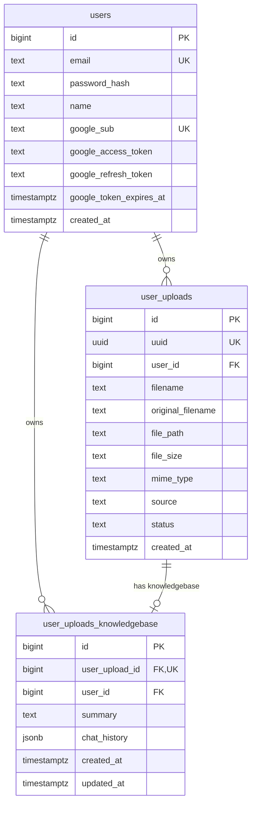

# EarlySnap — Database Structure & Schema Reference

Database engine: **PostgreSQL**  
Database name: `earlysnap`  
User: `earlysnap`  
Primary Schema definition file: [`db/schema.sql`](../db/schema.sql)

---

## Entity Relationship Summary

---

## Tables Overview

### 1. `users`
Stores registered user credentials, user profile information, and Google OAuth tokens.

| Column | Type | Constraints | Description |
|---|---|---|---|
| `id` | `BIGINT` | `PRIMARY KEY`, `BIGSERIAL` | Unique auto-incrementing user ID |
| `email` | `TEXT` | `NOT NULL`, `UNIQUE` | User email address (stored lowercased + trimmed) |
| `password_hash` | `TEXT` | `NULLABLE` | Password hash created via `password_hash()`. `NULL` for Google-only login |
| `name` | `TEXT` | `NULLABLE` | User display name |
| `google_sub` | `TEXT` | `UNIQUE`, `NULLABLE` | Google OAuth `sub` unique subject identifier |
| `google_access_token` | `TEXT` | `NULLABLE` | Google OAuth access token |
| `google_refresh_token` | `TEXT` | `NULLABLE` | Google OAuth refresh token for offline calendar/API access |
| `google_token_expires_at` | `TIMESTAMPTZ` | `NULLABLE` | Expiration timestamp for Google access token |
| `created_at` | `TIMESTAMPTZ` | `NOT NULL`, `DEFAULT now()` | User registration timestamp |

#### Indexes & Constraints
- `users_pkey`: `PRIMARY KEY (id)`
- `users_email_key`: `UNIQUE (email)`
- `users_google_sub_key`: `UNIQUE (google_sub)`

---

### 2. `user_uploads`
Stores metadata and disk storage paths for documents photographed via browser camera or uploaded by users.

| Column | Type | Constraints | Description |
|---|---|---|---|
| `id` | `BIGINT` | `PRIMARY KEY`, `BIGSERIAL` | Unique auto-incrementing record ID |
| `uuid` | `UUID` | `NOT NULL`, `UNIQUE` | Public unique identifier (RFC 4122 v4 UUID) |
| `user_id` | `BIGINT` | `NOT NULL`, `FK -> users(id)` | Foreign key linking to owning user (cascades on deletion) |
| `filename` | `TEXT` | `NOT NULL` | Stored file name on disk (e.g., `daab7d07-8cfb-467d-8655-5896296582f8.jpg`) |
| `original_filename` | `TEXT` | `NOT NULL` | Original client file name (e.g., `camera_capture_1784964319555.jpg`) |
| `file_path` | `TEXT` | `NOT NULL` | Relative file path from project root (e.g., `user-uploads/<uuid>.jpg`) |
| `file_size` | `BIGINT` | `NOT NULL` | File size in bytes |
| `mime_type` | `TEXT` | `NOT NULL` | MIME content type (e.g., `image/jpeg`, `image/png`, `application/pdf`) |
| `source` | `TEXT` | `NOT NULL`, `DEFAULT 'camera'` | Capture source: `'camera'` or `'file_input'` |
| `status` | `TEXT` | `NOT NULL`, `DEFAULT 'pending'` | Processing status: `'pending'`, `'processed'`, `'error'` |
| `doc_type` | `TEXT` | `NULLABLE` | Categorized document type (`'bill'`, `'prescription'`, `'handwritten_note'`, `'receipt'`, `'general'`) |
| `extracted_json` | `JSONB` | `NULLABLE` | Extracted structured JSON data returned from Google Gemini API |
| `created_at` | `TIMESTAMPTZ` | `NOT NULL`, `DEFAULT now()` | Upload timestamp |

#### Indexes & Constraints
- `user_uploads_pkey`: `PRIMARY KEY (id)`
- `user_uploads_uuid_key`: `UNIQUE (uuid)`
- `idx_user_uploads_user_id`: B-tree index on `user_id`
- `idx_user_uploads_uuid`: B-tree index on `uuid`
- `user_uploads_user_id_fkey`: `FOREIGN KEY (user_id) REFERENCES users(id) ON DELETE CASCADE`

---

### 3. `user_uploads_knowledgebase`
Stores AI chat conversation logs and cumulative chat summaries for specific document uploads.

| Column | Type | Constraints | Description |
|---|---|---|---|
| `id` | `BIGINT` | `PRIMARY KEY`, `BIGSERIAL` | Unique record ID |
| `user_upload_id` | `BIGINT` | `NOT NULL`, `UNIQUE`, `FK -> user_uploads(id)` | Foreign key linking to target upload (cascades on deletion) |
| `user_id` | `BIGINT` | `NOT NULL`, `FK -> users(id)` | Foreign key linking to owning user (cascades on deletion) |
| `summary` | `TEXT` | `NULLABLE` | AI-generated summary of chat interactions for extending/improving the document context |
| `chat_history` | `JSONB` | `NOT NULL`, `DEFAULT '[]'` | JSON array of chat messages maintaining full context & conversation history |
| `created_at` | `TIMESTAMPTZ` | `NOT NULL`, `DEFAULT now()` | Creation timestamp |
| `updated_at` | `TIMESTAMPTZ` | `NOT NULL`, `DEFAULT now()` | Last chat update timestamp |

#### Indexes & Constraints
- `user_uploads_knowledgebase_pkey`: `PRIMARY KEY (id)`
- `user_uploads_kb_upload_id_key`: `UNIQUE (user_upload_id)`
- `idx_user_uploads_kb_upload_id`: B-tree index on `user_upload_id`
- `idx_user_uploads_kb_user_id`: B-tree index on `user_id`
- `user_uploads_knowledgebase_user_upload_id_fkey`: `FOREIGN KEY (user_upload_id) REFERENCES user_uploads(id) ON DELETE CASCADE`
- `user_uploads_knowledgebase_user_id_fkey`: `FOREIGN KEY (user_id) REFERENCES users(id) ON DELETE CASCADE`
